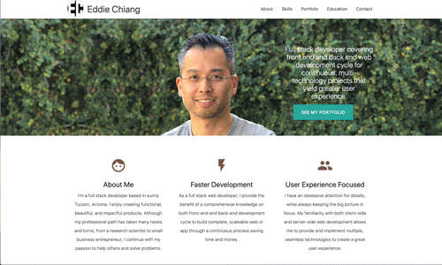
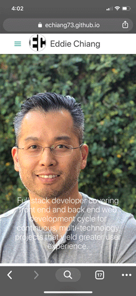

# echiang73.github.io
Welcome to my web developer portfolio!

My name is Eddie Chiang, and I'm a Full-Stack Developer with a passion for the digital revolution. With both front-end and back-end web developer skills, I aim to incorporate familiarity with all layers of web design and development to anticipate and avoid potential problems and create visually-stunning yet simplistic products.

I have a strong background as a biomedical research scientist and an entrepreneur for a biotechnology start-up company, which means that I have an eye for details while always keeping the big picture in mind.  I hope to incorporate my professional experience and vast knowledge of business/research & development as transferable skills for a Web Designer/Developer.

Click on the link!
https://echiang73.github.io/

## Built with
* HTML5
* CSS3
* JavaScript
* Bootstrap
* jQuery
* Materialize CSS
* Responsive Web Design Media Query
* Font Awesome

### Here are the previews of the web application:

